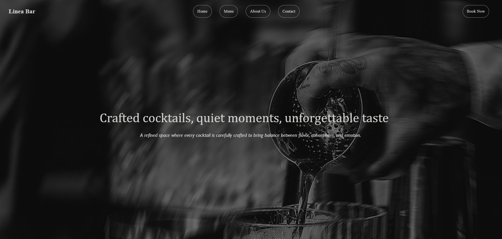
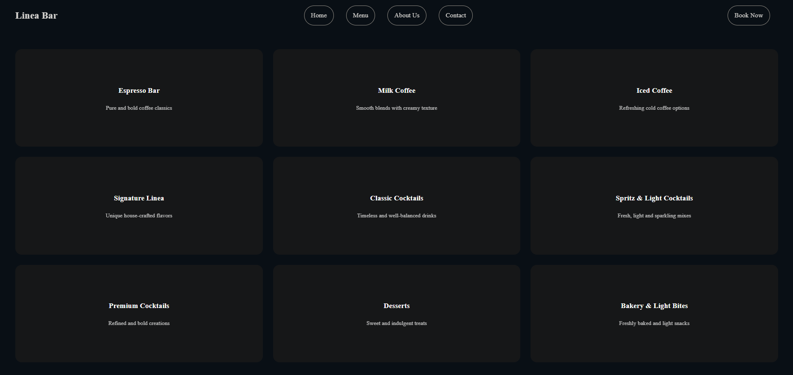
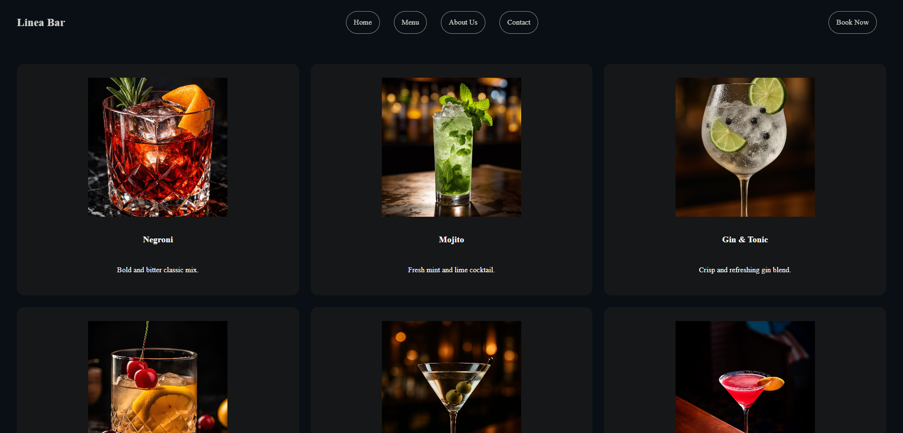
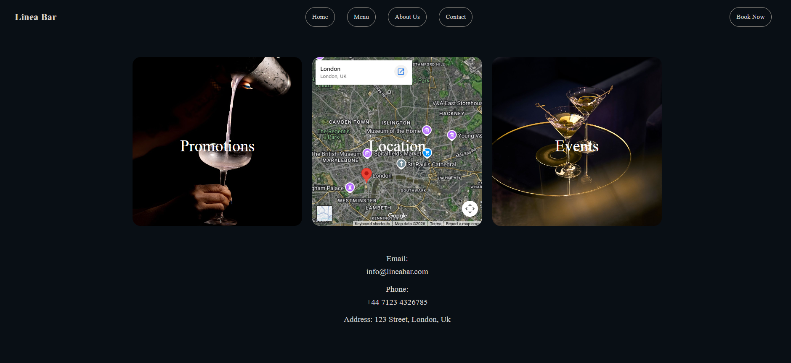

# Linea Bar 🍸

A concept driven bar website built as a creative portfolio project. Linea Bar combines minimal elegance with a refined digital experience, designed to feel both sophisticated and welcoming.

---

## Preview

### Home

### Menu

### Products

### Contact

---

## Pages

- **Home** — Hero section with atmospheric background and open/happy hours info
- **Menu** — Category grid linking to individual drink/food sections
- **Product Pages** — Espresso, Milk Coffee, Iced Coffee, Signature Linea, Classic Cocktails, Spritz & Light Cocktails, Premium Cocktails, Desserts, Bakery & Light Bites
- **About** — Brand story and concept
- **Contact** — Promotions, location map, and events
- **Booking** — Table reservation form with JavaScript validation

---

## Built With

- **HTML5** — Semantic structure across 15+ pages
- **CSS3** — Custom styling with CSS variables, Flexbox, CSS Grid, and responsive media queries (4 breakpoints)
- **JavaScript** — Booking form validation and confirmation feedback

---

## Features

- Fully responsive design (Desktop, Tablet, Mobile)
- Sticky navbar across all pages
- CSS Grid product layouts
- Google Maps embed
- Table booking with JS validation
- Consistent dark theme with `#090f15` base and `#d3d1ce` text

---

## Structure

Linea Bar/
├── home.html
├── menu.html
├── about.html
├── contact.html
├── booking.html
├── Espresso.html
├── MilkCoffee.html
├── IcedCoffee.html
├── SignatureLinea.html
├── ClassicCocktails.html
├── PremiumCocktails.html
├── Desserts.html
├── Bakery&LightBites.html
├── homecafe.css
├── menu.css
├── about.css
├── contact.css
├── booking.css
├── drinks.css
├── script.js
└── image/

## Author

Built by Megi Davidhi | Frontend Developer & Designer  
[LinkedIn](https://www.linkedin.com/in/megi-davidhi-851112414/) · [GitHub](https://github.com/davidhimegi25-a11y)

 *"Crafted cocktails, quiet moments, unforgettable taste."*
